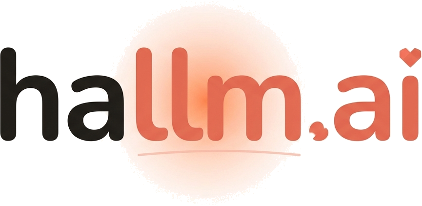

<p align="center">
  
</p>

<h3 align="center">AI Voice Companion for Elderly Parents</h3>

<p align="center">
  A voice-first AI that listens, remembers, and grows closer over time.<br/>
  Powered by <strong>Gemini Live API</strong> — built for the <a href="https://devpost.com/">Gemini Live Agent Challenge</a>.
</p>

<p align="center">
  <a href="#features">Features</a> · <a href="#architecture">Architecture</a> · <a href="#tech-stack">Tech Stack</a> · <a href="#getting-started">Getting Started</a> · <a href="#testing-guide-for-judges">Testing Guide</a>
</p>

---

## The Problem

Over **240 million** elderly people worldwide live alone. In South Korea, 20%+ of the population is now aged 65 or older. Existing AI assistants are text-based — fundamentally inaccessible to seniors who never learned to type on a smartphone. Smart speakers offer limited conversational depth and zero emotional continuity.

Adult children want to call every day, but work and family demands make it impossible. The guilt compounds on both sides.

## The Solution

**hallmai** is a voice-only AI companion that builds a deepening relationship with elderly users. There is no text input anywhere. The entire experience is one button: press to call, press to hang up.

The AI remembers their stories, adapts to their personality, and keeps families connected through daily Story Cards — a living feed of their parent's emotional world, generated automatically from every conversation.

## Features

### Voice Conversation with Living Memory
- **Soul Engine** — Extracts a 10-dimension personality profile (interests, family, routines, emotions, preferences) from every conversation, stored as JSONB and injected into subsequent sessions
- **3-Tier Maturity System** — Relationship progresses through *explore → bonding → friend*, each with distinct conversation strategies
- **Session Renewal** — Transparently swaps Gemini sessions every 10 turns, preserving full context with audio buffering. Users talk for hours without noticing

### In-Conversation Tools
- **Google Search** — Gemini Live API native `googleSearch` tool for real-time web grounding
- **YouTube Search & Playback** — Custom function declarations + YouTube Data API v3 for mid-conversation video playback
- **Camera** — Take a photo via native camera, sent as `sendClientContent` inlineData for visual conversation

### Family Experience
- **Daily Story Cards** — Cron job generates cards with topic summary, direct quote, and mood indicator (warm/calm/quiet) using Gemini JSON mode
- **Feed UI** — Alert cards, voice summaries, mood charts, weekly insights — a daily window into their parent's day

### Accessibility
- **Zero text input** — Every interaction via voice or single button press
- **Volume-responsive pulsation** — Button scales with microphone RMS so users can *see* the AI listening
- **RNNoise suppression** — WASM-based noise filtering for TVs/radios in the background
- **Silence detection** — 30s warning → 45s graceful AI farewell → auto-disconnect
- **Senior-friendly errors** — Large text + voice feedback, no toasts or modals

## Architecture

```
┌─────────────────────────────────────────────────────────────────┐
│  Client (Next.js 16 + Capacitor 8)                              │
│  ┌──────────┐  ┌──────────┐  ┌──────────┐  ┌───────────────┐   │
│  │ AudioRec │  │AudioPlay │  │ RNNoise  │  │  Camera       │   │
│  │ (16kHz)  │  │ (24kHz)  │  │  WASM    │  │ (Capacitor)   │   │
│  └────┬─────┘  └────▲─────┘  └──────────┘  └───────────────┘   │
│       │              │                                           │
│       └──── WebSocket (ws/voice) ────┘                          │
└─────────────────────────┬───────────────────────────────────────┘
                          │
┌─────────────────────────▼───────────────────────────────────────┐
│  Backend (NestJS 11 on Cloud Run)                                │
│                                                                  │
│  ┌─────────────────┐    ┌──────────────────────────────────┐    │
│  │ Voice Gateway   │───▶│ Gemini Live API                  │    │
│  │ (WebSocket)     │◀───│ gemini-2.5-flash-native-audio    │    │
│  │                 │    │                                  │    │
│  │ • Audio relay   │    │ • Native voice I/O               │    │
│  │ • Tool dispatch │    │ • Google Search (built-in)       │    │
│  │ • Session renew │    │ • YouTube search/play (custom)   │    │
│  │ • Silence detect│    │ • inputAudioTranscription        │    │
│  └─────────────────┘    └──────────────────────────────────┘    │
│                                                                  │
│  ┌─────────────────┐    ┌──────────────────────────────────┐    │
│  │ Soul Engine     │───▶│ Gemini Text API (JSON mode)      │    │
│  │ Card Generator  │───▶│ Structured extraction            │    │
│  │ Summarizer      │───▶│ Prompt injection defense         │    │
│  └─────────────────┘    └──────────────────────────────────┘    │
│                                                                  │
│  ┌─────────────────┐                                            │
│  │ Cloud SQL       │  PostgreSQL — Soul, conversations,         │
│  │ (TypeORM)       │  transcripts, story cards, devices          │
│  └─────────────────┘                                            │
└──────────────────────────────────────────────────────────────────┘
```

### 4 Gemini Integration Points

| # | Integration | Model | Purpose |
|---|------------|-------|---------|
| 1 | **Gemini Live API** | `gemini-2.5-flash-native-audio` | Real-time bidirectional voice with native Google Search + custom YouTube function calling |
| 2 | **Soul Engine** | Gemini Text (JSON mode) | Extract 10-dimension personality profile from conversation transcripts |
| 3 | **Card Generator** | Gemini Text (JSON mode) | Generate daily Story Cards with topic, quote, and mood from transcripts |
| 4 | **Summarizer** | Gemini Text | Conversation summarization for session renewal context injection |

## Tech Stack

| Layer | Technology |
|-------|-----------|
| **AI** | Gemini Live API, Google GenAI SDK (`@google/genai`) |
| **Frontend** | Next.js 16, React 19, TypeScript, Tailwind CSS v4 |
| **Mobile** | Capacitor 8 (iOS + Android) |
| **Backend** | NestJS 11, TypeORM, PostgreSQL |
| **Infra** | Google Cloud Run, Cloud SQL, Secret Manager, Terraform |
| **CI/CD** | GitHub Actions, Artifact Registry |
| **Audio** | RNNoise WASM (`@sapphi-red/web-noise-suppressor`) |
| **Search** | YouTube Data API v3 |

## Getting Started

### Prerequisites

- Node.js 20+
- Yarn
- Docker (for PostgreSQL)
- A Gemini API key from [Google AI Studio](https://aistudio.google.com/apikey)

### Quick Start (One Command)

```bash
git clone https://github.com/hallmai/hallmai.git
cd hallmai

# 1. Start PostgreSQL
docker compose up -d

# 2. Configure backend
cd backend
cp .env.example .env
# Edit .env — at minimum set GEMINI_API_KEY
cd ..

# 3. Start everything
./start-local.sh
```

This launches PostgreSQL, the NestJS backend (port 4000), and the Next.js frontend (port 3000) in a single terminal.

### Manual Start (Step by Step)

```bash
# 1. Start PostgreSQL
docker compose up -d

# 2. Backend
cd backend
cp .env.example .env    # Edit: set GEMINI_API_KEY (required)
yarn install
yarn start:dev          # Runs on http://localhost:4000

# 3. Frontend (new terminal)
cd frontend
yarn install
yarn dev                # Runs on http://localhost:3000
```

### Environment Variables

| Variable | Required | Description |
|----------|----------|------------|
| `GEMINI_API_KEY` | **Yes** | Gemini API key from [Google AI Studio](https://aistudio.google.com/apikey) |
| `DB_HOST` | No | Default: `localhost` |
| `DB_PORT` | No | Default: `5432` |
| `DB_USERNAME` | No | Default: `postgres` |
| `DB_PASSWORD` | No | Default: `postgres` |
| `DB_DATABASE` | No | Default: `hallmai` |
| `JWT_SECRET` | No | Default provided in `.env.example` |
| `YOUTUBE_API_KEY` | No | Enables YouTube search/playback during calls |
| `GOOGLE_CLIENT_ID` | No | Required only for family Google login |
| `GOOGLE_CLIENT_SECRET` | No | Required only for family Google login |

> **Minimum setup:** Only `GEMINI_API_KEY` is needed. All other variables have working defaults via `docker compose` and `.env.example`. The core voice experience works without YouTube or Google OAuth keys.

### Mobile Build (Optional)

```bash
cd frontend
yarn build
npx cap sync
npx cap open ios     # or: npx cap open android
```

## Testing Guide for Judges

### What You Need

- A computer with a **microphone** (the app is voice-only)
- A **Chrome/Edge** browser (for WebRTC microphone access)
- A **Gemini API key** (free at [Google AI Studio](https://aistudio.google.com/apikey))
- **Docker** installed (for PostgreSQL)

### Step 1: Run Locally (5 minutes)

```bash
git clone https://github.com/hallmai/hallmai.git
cd hallmai
docker compose up -d
cd backend && cp .env.example .env
```

Edit `backend/.env` and paste your Gemini API key:
```
GEMINI_API_KEY=your-key-here
```

Then start:
```bash
cd .. && ./start-local.sh
```

Wait until you see both servers are ready, then open **http://localhost:3000** in Chrome.

### Step 2: Test Voice Conversation

1. Open http://localhost:3000 — you'll see the **Call** screen with a large coral button
2. **Tap the coral button** to start a call
3. **Allow microphone access** when prompted
4. The AI will greet you in Korean — speak back naturally
5. The button **pulses with your voice volume** (RMS visualization)
6. **Tap again** to end the call

> The AI speaks Korean by default. You can speak in Korean or English — it will adapt.

### Step 3: Test Hotkeys (During a Call)

While a call is active, the **hotkey grid** appears at the top:

| Hotkey | What it does |
|--------|-------------|
| **Camera** | Opens native camera (or file picker on desktop). Take/select a photo — it's sent to Gemini and the AI discusses what it sees |
| **Search** | Sends a search trigger. The AI asks what you want to search, then uses Google Search to ground its response |
| **YouTube** | Sends a YouTube trigger. The AI asks what to play, searches YouTube Data API, reads results, and plays your selection |

### Step 4: Test Soul Engine & Memory

1. Have a **2-3 minute conversation** — mention your name, hobbies, family
2. **End the call** (tap the button)
3. **Start a new call** — the AI will remember what you talked about
4. Check the database to see the Soul profile: the backend logs show Soul extraction after each call

### Step 5: Test Family Features (Optional)

Requires `GOOGLE_CLIENT_ID` and `GOOGLE_CLIENT_SECRET` in `.env`:

1. Go to **Settings** (bottom nav) → **Sign in with Google**
2. After login, go to **Stories** tab to see Story Cards
3. Story Cards are generated daily at 10:00 AM KST, or you can trigger manually via the card generator service

### What to Look For

| Feature | Where to see it |
|---------|----------------|
| Real-time voice with Gemini | Call screen — natural bidirectional conversation |
| Soul Engine memory | Start a second call — AI references your first conversation |
| Session renewal | Talk for 10+ turns — session swaps transparently |
| Google Search tool use | Tap Search hotkey during a call |
| YouTube tool use | Tap YouTube hotkey during a call |
| Camera + vision | Tap Camera hotkey, send a photo |
| Silence detection | Stay silent for 30s — AI warns, then ends at 45s |
| Volume pulsation | Watch the button scale during speaking/listening |
| Noise suppression | Toggle in Settings — filters background noise |
| Story Cards | Login as family → Stories tab |

### Troubleshooting

| Issue | Fix |
|-------|-----|
| Microphone not working | Use Chrome/Edge, allow mic permissions, check `chrome://settings/content/microphone` |
| "Connection failed" | Ensure backend is running on port 4000. Check `logs/backend.log` |
| No AI audio response | Verify `GEMINI_API_KEY` is valid. Check backend logs for Gemini errors |
| YouTube not working | `YOUTUBE_API_KEY` is optional — add it to `.env` to enable YouTube search |

## Key Technical Innovations

### Session Renewal for Infinite Conversations
Gemini Live API sessions have context limits. We transparently swap sessions every 10 user turns:
1. Save transcript → 2. Generate summary → 3. Extract Soul → 4. Create new session with full context → 5. Flush buffered audio

The user experiences zero interruption.

### Prompt Injection Defense
User transcripts are processed by the Soul Engine and Card Generator. We defend against injection via:
- `<transcript>` isolation tags wrapping all user-generated content
- Tag-escape stripping of any existing transcript tags
- Explicit model instructions to ignore directives within transcript data

### Soul Maturity Progression
The AI's personality evolves based on how much it knows about the user:

| Stage | Trigger | Behavior |
|-------|---------|----------|
| **Explore** | < 3 profile dimensions filled | Introduces itself, gently learns about the user |
| **Bonding** | 3-4 dimensions filled | Weaves known info naturally, never forces references |
| **Friend** | All 5 dimensions filled | Proactively suggests favorite topics, comfortable familiarity |

## Project Structure

```
hallmai/
├── backend/                  # NestJS 11 API server
│   └── src/
│       └── modules/
│           ├── voice/        # WebSocket gateway, Gemini Live API, YouTube
│           ├── soul/         # Soul Engine — personality extraction
│           ├── story-card/   # Card Generator — daily family updates
│           ├── conversation/ # Conversation records & transcripts
│           ├── device/       # Senior device registration
│           ├── health/       # Health check endpoint
│           └── auth/         # JWT + Google OAuth
├── frontend/                 # Next.js 16 + React 19
│   └── src/
│       ├── app/(main)/       # Call, Stories, Settings pages
│       ├── hooks/            # useVoice, useDevice
│       ├── lib/              # VoiceClient, camera, i18n, auth
│       └── components/       # CareCard, story feed components
├── infra/                    # Terraform (Cloud Run, Cloud SQL, IAM, Secrets)
├── docs/                     # Product specs, feature list
└── docker-compose.yml        # Local PostgreSQL
```

## 22 Features Shipped

F-02 Conversation memory · F-04 Personal question pool · F-20 Senior error UX · F-22 Silence detection · F-23 Capacitor native build · F-24 Transcript saving · F-25 Device registration · F-29 Soul Engine · F-30 Google Search · F-31 YouTube search/play · F-33 Structured logging · F-34 JSON mode · F-35 Global GeminiProvider · F-36 Prompt injection defense · F-37 Soul maturity prompts · F-39 Volume pulsation · F-40 RNNoise suppression · F-42a Hotkey grid & interrupt · F-41 Caller name/speech style · F-42 Temporal summaries · F-43 Session renewal · F-44 Camera hotkey

## What's Next

- **Proactive AI Outreach** — AI initiates daily calls at the user's preferred time
- **Weekly Family Insights** — AI-generated weekly analysis of conversation patterns and emotional trends
- **Voice Briefings** — Story card summaries as audio for busy family members
- **App Store Launch** — iOS App Store and Google Play Store release

## License

Proprietary. All rights reserved.
